# 跨数据集特征分布差异分析报告
## 90plus 与 I-CONECT 数据集特征分布系统对比

**分析日期：** 2026-10-06  
**分析人：** Catherine Lv  
**数据来源：** `docs/analysis/cross-cohort/2026-10-02-feature-distributions/`  
**可视化目录：** `results/plots/`

---

## 一、执行摘要

本报告基于对 547 个特征的系统性统计分析，全面评估 90plus 与 I-CONECT（以下简称 IC）两个数据集之间的分布差异。分析覆盖语言学（ling）、时序（temporal）、语义（semantic）及声学（acoustic）四大模态，采用 Cohen's *d*、Kolmogorov-Smirnov（KS）统计量、支持域重叠率及域可辨别 AUC 等多维度指标。

**核心结论：**

- **域迁移风险高**：四大特征族（语言、时序、声学、语义）的域可辨别 AUC 为 0.931–1.000，其中时序、声学两族达到 1.000，语言族为 0.998，表明两数据集在特征空间中高度可区分，直接迁移将面临严峻挑战。
- **大幅偏移主导**：547 个特征中 279 个（51.0%）属于"large"级别偏移（|*d*| ≥ 0.8），中位 |*d*| = 0.829，均值 |*d*| = 1.226。
- **IC 系统性偏高**：358/547 个特征（65.4%）在 IC 数据集中均值更高，提示 IC 受访者在声学表达多样性、语言产出量及对话参与度上整体高于 90plus。
- **特征族异质性显著**：时序族迁移风险最高（AUC = 1.000，支持域平均重叠率最低，仅 53.7%）；语言族平均偏移最大（mean |*d*| = 1.704）；语义族相对最低（AUC = 0.931，重叠率 73.4%）。
- **IC 内部存在长/短对话两个子群**：以对话时长 900 s 为界，71 名长对话受试者（中位数约 25 分钟）贡献了语言、声学、语义族的大部分偏移；85 名短对话受试者在计数类语言特征上与 NP 接近。但停顿、轮次率等时序特征在两个子群中都与 NP 明显不同（见 2.3.2 样例 F、第五章）。
- **分布形变多样**：偏移类型涵盖均值平移、方差倍增/压缩、分布形状畸变，部分声学特征呈现极端尺度变化（IC 方差为 90+ 的 100 倍以上），提示两数据集在录制条件和交互协议上存在本质差异。

---

## 二、数据集与分析方法概述

### 2.1 数据集基本信息

| 数据集 | 简称 | 受试者数量 | 特征数量 | 人群特点 |
|--------|------|-----------|---------|---------|
| 90plus | NP | n ≈ 1,120 | 547 | 高龄老人（≥90岁），社区随访 |
| I-CONECT | IC | n ≈ 156 | 547 | 认知下降风险老人，干预研究 |

### 2.2 特征体系

本报告把 547 个特征归为四大族，所有族级统计、摘要图和迁移风险评估都以这四个族为单位：

| 特征族 | 数量 | 包含内容 |
|--------|------|---------|
| 语言（ling） | 99 | LIWC 心理语言学类别、句法复杂度（T-单元、从句等计数与比率）、词汇多样性（TTR、MTLD 等）、回答长度 |
| 时序（temporal） | 24 | 受试者时序行为（`pt_*`：发言时长、语速、停顿）12 个，双人对话交互（`ix_*`：对话时长、轮次、应答延迟、打断）12 个 |
| 声学（acoustic） | 420 | eGeMAPS 88 个基础特征 + MFCC 52 个基础特征，各取整段 / 分段均值 / 分段标准差 3 种聚合 |
| 语义（semantic） | 4 | 内容词密度、内容多样性、语义扩散度、内容词频率 |
| **合计** | **547** | |

### 2.3 分析方法

**分布差异量化：**
- **Cohen's *d***：标准化均值差，带方向；|*d*| 按 0.2/0.5/0.8 分为 negligible/small/medium/large 四级
- **KS 统计量**（Kolmogorov-Smirnov）：两组累积分布的最大差距，不依赖参数假设，对分布形状差异敏感

两个统计量都在受试者层面计算（每名受试者一个特征值），比较 IC（n ≈ 156）与 NP（n ≈ 1,120）。*d* 回答“平均水平差多少、往哪个方向差”，KS 回答“整个分布能被分开到什么程度”，两者互补。下面先说明原理与用途，再用单特征分布图解读代表性样例。

#### 2.3.1 原理与目的

**（1）Cohen's *d* —— 均值差有多大？**

- **原理**：用合并标准差把两组均值差标准化：

  *d* = (x̄IC − x̄NP) / *s*pooled，其中 *s*pooled = √{[(nIC−1)s²IC + (nNP−1)s²NP] / (nIC+nNP−2)}

  *d* 带符号：正值表示 IC 均值更高，负值表示 NP 均值更高。
- **目的**：给出一个与量纲无关、可跨特征比较的“平均水平偏移量”，并按 Cohen 惯例分级（0.2/0.5/0.8）。它直接对应“做 z-score 标准化或均值对齐能消除多少差异”，也是本报告偏移等级（shift_category）的依据。
- **局限**：只看均值。
  - 两组均值相同但方差或形状不同时，*d* ≈ 0，会**漏报**。
  - 合并标准差会被重尾放大，*d* 因而被**压低**。
  - 反过来，均值也会被少数极端个体拉高，*d* 因而**高估**“典型受试者”之间的差异。

**（2）KS 统计量 —— 两条累积分布曲线最远差多少？**

- **原理**：取两组经验累积分布函数（ECDF）之间的最大纵向距离：

  KS = supt |FIC(t) − FNP(t)|，取值 [0, 1]

  KS = 0 表示两条 ECDF 完全重合；KS = 1 表示存在某个阈值 *t*，能把两组受试者完全分开。KS 还附带非参数检验的 *p* 值。
- **目的**：
  - 不对分布作任何参数假设。位置、尺度、偏度、多峰性中只要有一处不同，ECDF 就会分开，所以它能捕捉 *d* 看不到的**形状/尺度差异**。
  - 只依赖秩次，不受极端值大小影响，因此可以**校验 *d* 是否被离群值扭曲**。
  - 解释直观：KS 等于用单一阈值切分两组时能达到的最大（真阳性率 − 假阳性率），即单特征分类的 Youden 指数上限。
  - 无需任何调参（不需要带宽或分箱）。
- **局限**：只记录“最远的一个点”，不反映差异的范围，也没有方向（方向看 *d*）。样本量大时 *p* 值几乎总是显著（本研究 547 个特征中 462 个 *p* < 0.001），因此本报告用 KS **统计量本身**衡量效应大小，不以 *p* 值作判断。

**两者对照与联合判读：**

| | Cohen's *d* | KS |
|---|---|---|
| 比较的对象 | 均值（以合并 SD 标准化） | 两条 ECDF 的最大纵向距离 |
| 取值范围 | (−∞, +∞)，带方向 | [0, 1]，无方向 |
| 主要捕捉 | 位置平移 | 任意类型的分布差异 |
| 对离群值 | 敏感（可被放大或压低） | 稳健（只看秩次） |
| 容易漏掉 | 方差/形状变化 | 差异的方向与远近 |

| 组合 | 含义 | 本研究特征数 |
|---|---|---|
| \|*d*\| 大，KS 大 | 整体平移，两种指标一致 | — |
| \|*d*\| < 0.5，KS > 0.3 | **形状/尺度变异**：均值几乎没动，但分布明显不同，*d* 漏报 | 66 |
| \|*d*\| ≥ 1.5，KS < 0.5 | ***d* 被少数极端个体拉高**：只有部分受试者真正被分开 | 69 |

> **为什么不再使用 Wasserstein 距离和 JS 距离？** 早期版本还计算了这两个指标，评估后剔除：
> - 归一化 Wasserstein 距离在一组整体压在另一组之上时与 |*d*| 严格相等。547 个特征中两者的秩相关为 0.98，信息几乎完全重复。
> - 基于 KDE 的 JS 距离在标记形状变异时与 KS 高度重合（它标出的 32 个形状变异特征中有 31 个已被 KS 标出），而且依赖带宽、易受离群值影响，数值上不如 KS 稳定。

#### 2.3.2 代表性样例解读

以下每张单特征图的结构相同：**上图**为两组的 KDE 密度曲线（蓝 = I-CONECT，橙 = 90+），虚线为各自中位数，底部短竖线为单个受试者的取值，右上角为 *d* 与 KS；**下图**为密度差 Δ = KDEIC − KDE90+，蓝色区域表示该处 IC 更多，橙色区域表示该处 NP 更多。std_ratio = SDIC / SDNP，作为辅助参考一并列出。

**样例 A：两个指标都小 —— `sm_content_freq`内容词平均词频（基线对照）**

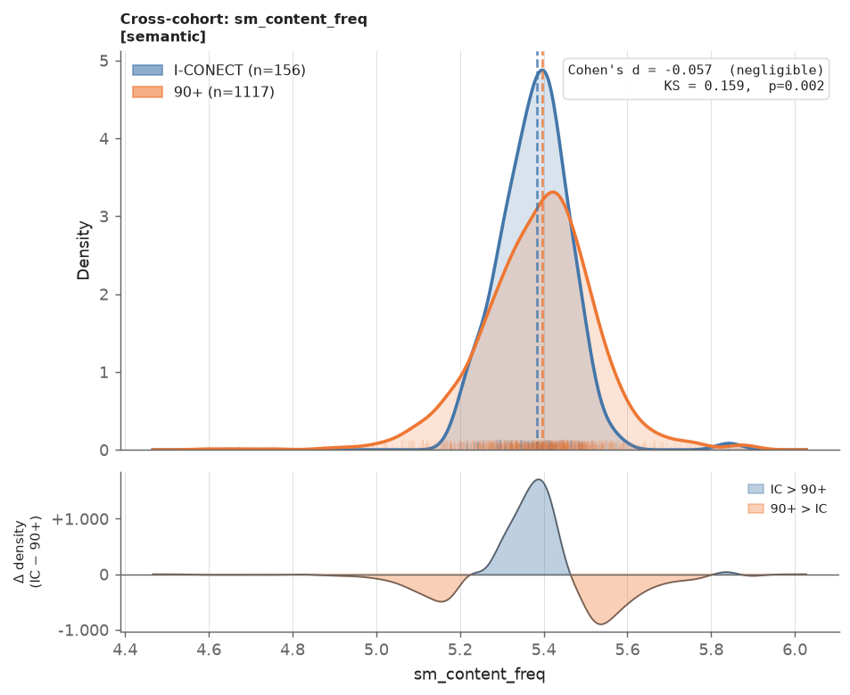

| *d* | KS | std_ratio |
|-----|----|----|
| −0.057 | 0.159 | 0.62 |

两条曲线的中位数几乎重合（≈ 5.38 vs 5.39），*d* 处于 negligible 级。图中 IC（蓝）峰更高更窄，NP（橙）两侧尾部更宽，所以下图呈现“中间蓝、两侧橙”的对称三瓣结构：均值没有移动，只是 IC 更集中。*d* 看不到这一点，KS（0.16）给出了小但非零的值，刻画的正是这部分方差差异。该特征可以作为“两数据集基本一致”的参照基线。

**样例 B：纯粹的大幅平移 —— `ix_n_interviewer_turns`访谈员发言轮次（两个指标一致偏大）**

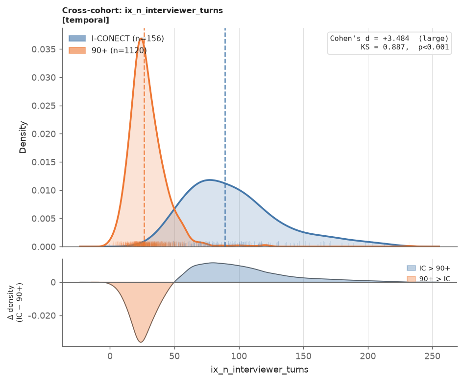

| *d* | KS | std_ratio |
|-----|----|----|
| +3.484 | 0.887 | 2.37 |

NP 的访谈员轮次集中在 25 左右，IC 则以约 90 为中心宽幅展开，两峰几乎错开。下图在约 50 处由橙转蓝，只过零一次，说明 IC 整体位于 NP 右侧。KS = 0.887 意味着以约 50 轮为阈值，就能把绝大多数受试者归到正确的数据集。这是两个指标**互相印证**的典型情形：差异主要是位置平移，可以用 *d* 概括。

**样例 C：*d* 很小、KS 较大 —— `ix_mean_response_latency_sec`受试者平均应答延迟（形状/尺度差异）**

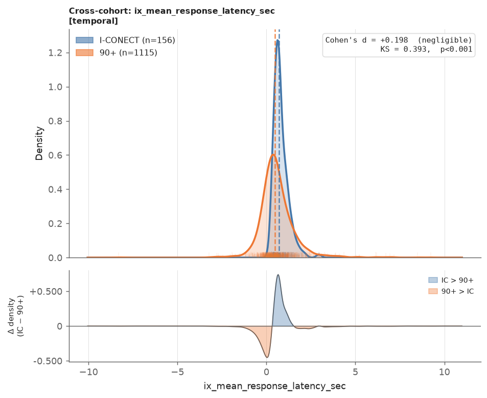

| *d* | KS | std_ratio |
|-----|----|----|
| +0.198 | 0.393 | 0.38 |

按 *d* 判断，这只是 negligible 级差异（0.198），但图像显示两组明显不同：IC 是集中在约 0.7 s 的尖峰（峰高 ≈ 1.25）；NP 的峰值在约 0.4 s，并向负值（抢话/重叠）和长延迟两侧拖尾。下图中 0 s 附近橙色占优（NP 中有大量接近零或为负的延迟），0.5–1.5 s 蓝色占优。NP 的长尾拉大了合并标准差，所以 *d* 被压低；KS（0.39）则如实反映出中等程度的分布差异。这正是 4.3 节的“形状变异型”：**只看 *d* 会严重低估迁移风险**。

**样例 D：重尾压低 *d* —— `Nonfluencies`言语不流利**

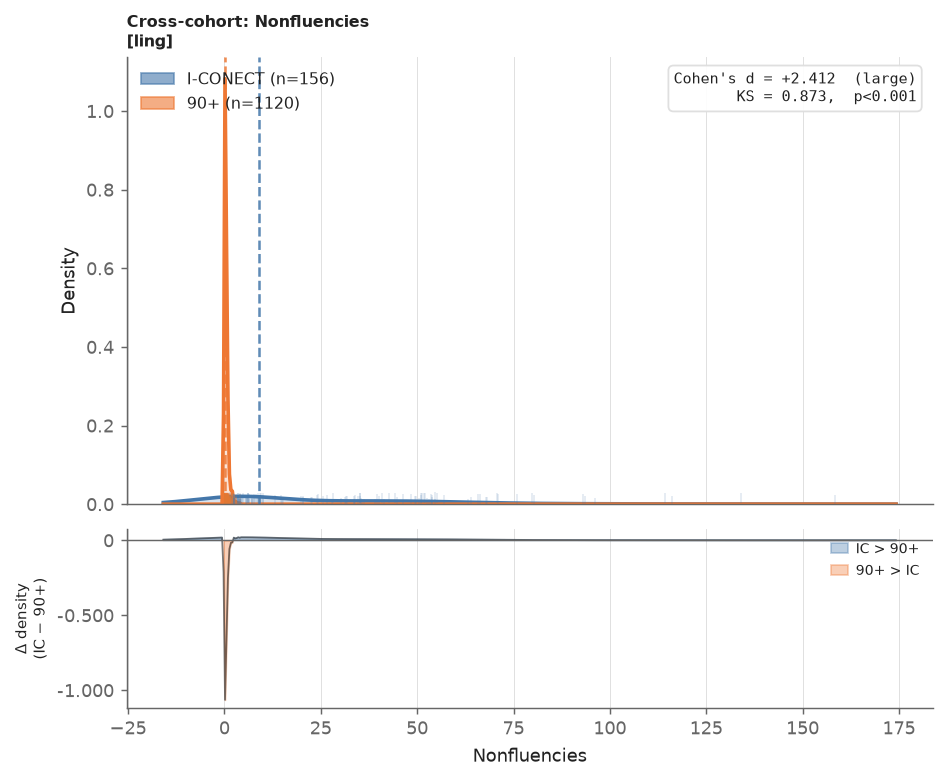

| *d* | KS | std_ratio |
|-----|----|----|
| +2.412 | 0.873 | 61.7 |

NP 几乎所有受试者都集中在 0 附近，形成一个高达 1.0 以上的尖峰（均值 0.38、SD 0.49）；IC 则从 0 一路平铺到 150 以上（均值 25.6、SD 30.0）。*d* = 2.41 已属 large，但 IC 的巨大方差主导了 *s*pooled，*d* 实际上**低估**了两组的分离程度。KS = 0.873 表明一个很低的阈值就能分开绝大多数受试者，比 *d* 更能如实反映差异。

**样例 E：方差大幅压缩 —— `pt_long_pause_per_min`受试者每分钟长停顿（>2 s）次数**

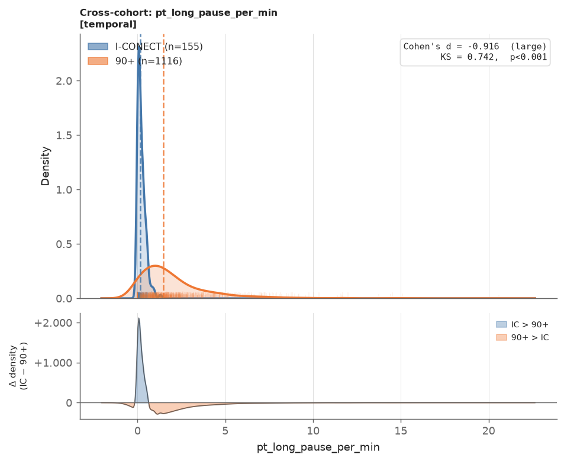

| *d* | KS | std_ratio |
|-----|----|----|
| −0.916 | 0.742 | 0.11 |

IC 的长停顿频率几乎都集中在 0–0.5 次/分钟（尖峰高约 2.3），NP 则以约 1 次/分钟为峰、一直拖尾到 10 次以上。*d* = −0.92 只是刚过 large 阈值，排名并不靠前，但 KS 高达 0.742：存在一个停顿频率阈值，能把两组的累积比例拉开 74 个百分点。这说明 IC 受试者不仅平均停顿更少，而且**彼此高度相似**（std_ratio = 0.11）。即使做了均值对齐，NP 训练出的模型在 IC 上也只会看到 NP 分布最左端的一小段，等同于外推。

**样例 F：*d* 很大、KS 只有中等 —— `Adverbs`副词（*d* 被子群拉高）**

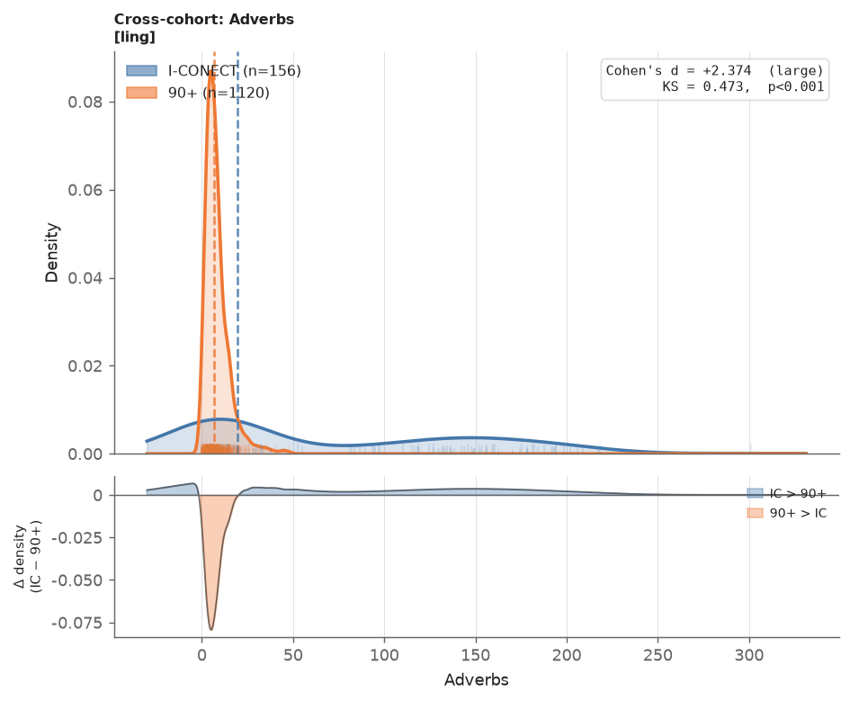

| *d* | KS | std_ratio |
|-----|----|----|
| +2.374 | 0.473 | 11.1 |

按 *d* 这是全库最大的语言学偏移之一，但 KS 只有 0.47。图中 IC 呈**双峰**：一个峰在 0–30，与 NP 的尖峰（中位数 6.7）大面积重叠；另一个宽峰在 100–200，NP 完全没有。IC 的均值（71.8）远高于中位数（19.8），正是被高值子群拉起来的。

进一步核查发现，两个峰对应 IC 内部两个对话时长截然不同的子群（以对话时长 900 s 为界）：

| 子群 | 人数 | 对话时长中位数 | `Adverbs`中位数 | `pt_total_words`受试者总词数中位数 |
|---|---|---|---|---|
| IC 长对话组 | 71 | 1,495 s（约 25 分钟） | 147.8 | 2,277 |
| IC 短对话组 | 85 | 451 s | 6.8 | 111 |
| NP | 1,120 | 174 s | 6.7 | 155 |

IC 短对话组的副词数与 NP 几乎相同；“大幅偏移”完全来自长对话组。原因是这类 LIWC/语言学特征是**原始计数**，会随对话时长线性增长。*d* 把两个子群平均成了一个“整体大幅偏移”，KS 则揭示出这只是**部分**受试者的分离。全库共有 69 个特征 |*d*| ≥ 1.5 而 KS < 0.5（语言族 65 个、时序族 4 个），都属于此类计数型特征。这说明第五章中语言族的大幅偏移有很大一部分是**对话时长的产物**，对它们做话语量归一化（第七章建议）是必要的前提，而不是可选项。

#### 2.3.3 摘要图子图解读

`results/plots/family/` 下有两类摘要图：

| | 全局摘要图 `summary_all_features.png`（2×2） | 族摘要图 `summary_<family>.png`（3 个子图） |
|---|---|---|
| A | 全部受试者的 PCA 散点（全部 547 个特征） | 仅用本族特征的 PCA 散点 |
| B | 所有特征的 Cohen's *d* 直方图 | **逐特征棒棒糖图**：每行一个特征，按 *d* 排序；点的颜色 = KS，右侧数字 = 支持域重叠率（< 50% 标红）。族内超过 20 个特征时只显示 KS 最大的 20 个 |
| C | 支持域重叠率直方图 | 本族全部特征的 \|*d*\| vs KS 散点，点的颜色 = 支持域重叠率（红 = 低，绿 = 高） |
| D | \|*d*\| vs KS 散点（按四大族着色） | — |

各子图的计算方式：
- **PCA（两类图的 A）**：只保留在这些特征上没有任何缺失的受试者（complete case，图例中注明剔除了多少人），两组合并后做 z-score 标准化，再取前两个主成分。蓝 = IC，橙 = NP；坐标轴括号内是该主成分解释的方差比例。
- ***d* 直方图（全局 B）**：每个特征一个 *d* 值，按 negligible/small/medium/large 四级堆叠着色，虚线为 *d* = 0 和 ±0.8。
- **支持域重叠率**：对每个特征，计算 IC 受试者落在 NP [5th, 95th] 百分位区间内的比例。全局 C 中，橙色虚线 50% 为高外推风险线，灰色点线 80% 为“安全”线。
- **\|*d*\| vs KS（全局 D、族图 C）**：灰色阴影为形状变异区（|*d*| < 0.5 且 KS > 0.3），橙色虚线为 |*d*| = 0.8。

**（一）全局摘要图**

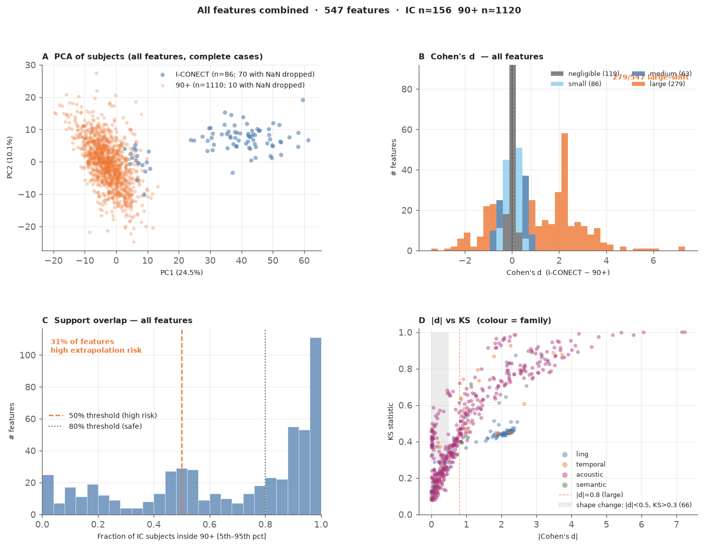

- **A｜PCA**：全局图用到全部 547 个特征（含 420 个声学特征），所以只有 86 名 IC 受试者有完整数据，另外 70 名缺少声学特征，被剔除；NP 剔除了 10 人。PC1 解释 24.5% 的方差，载荷最大的既有 MFCC/响度的“标准差”类声学特征，也有总词数等长度特征；PC2 解释 10.1%。NP 是以原点为中心的一团云。IC 分成两部分：
  - **右侧一簇**（PC1 24–61）：69 人，全部来自长对话组，与 NP 完全分开。
  - **NP 云团右缘**（PC1 3–11）：17 人，全部来自短对话组，与 NP 部分重叠。

  所以 IC 与 NP 在多变量空间里的“完全分离”，本质上是**长对话组与 NP 的分离**；短对话组与 NP 相当接近。

  > 方法说明：旧版本用 IC 中位数插补缺失值。由于 IC 里有声学数据的几乎都是长对话受试者，68 名没有声学数据的短对话受试者被统一填成了长对话组的声学典型值，在图中挤成一条笔直的斜线（插补伪影）。现已改为完整数据分析。

- **B｜*d* 分布**：547 个特征中 358 个 *d* > 0（IC 更高），189 个 *d* < 0。右侧在 *d* ≈ 1.8–2.4 处有一个尖峰（91 个特征，其中 63 个来自语言族），对应的正是样例 F 那类随对话时长增长的计数特征。左侧有 12 个特征 *d* ≤ −2，其中 10 个是声学特征：每秒有声段数、响度第 20 百分位、MFCC 第 1 系数均值、高阶 MFCC 差分等；另外 2 个是打断率和每分钟轮次数。large 级共 279 个（橙色）。
- **C｜支持域重叠**：分布呈两端高、中间低的 U 形。264 个特征（48%）的重叠率 ≥ 80%，可以放心迁移；167 个特征（31%）低于 50%，属于高外推风险；其中 46 个低于 10%（声学 40 个、时序 4 个、语言 2 个），即 IC 受试者几乎全部落在 NP 正常范围之外。
- **D｜\|*d*\| vs KS**：两者的秩相关 ρ = 0.81。
  - **主干单调上升、逐渐饱和**：|*d*| 从 0 增至约 2 时 KS 快速上升，之后趋于 0.8–1.0。没有任何特征 |*d*| ≥ 0.8 而 KS < 0.3，即 *d* 判为大幅偏移的，KS 都能确认。
  - **左侧阴影区**：66 个特征，其中 62 个来自声学族。均值几乎没动，但累积分布明显分开，与样例 C、E 同类，需要依赖 KS 识别。
  - **|*d*| ≈ 2–2.5、KS ≈ 0.45 的横向带**（蓝色，语言族）：即样例 F 的计数型语言特征。KS 停在约 0.45，恰好对应 IC 中约 45%（71/156）的长对话受试者。
  - `ix_interruption_rate`打断率（|*d*| = 2.37，KS = 0.985）：IC 侧恒为 0，支持域几乎完全不重叠（见 4.4 节）。

**（二）族摘要图：以时序族为例**

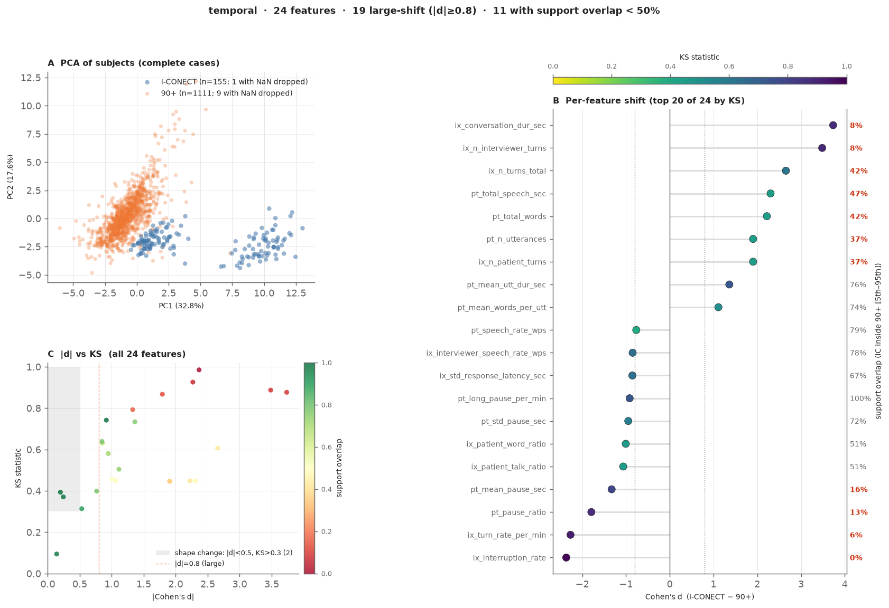

- **A｜PCA**：PC1（32.8%）是“对话规模”方向：受试者总发言时长、对话时长、总词数、总轮次的载荷都约为 +0.31～+0.33。PC2（17.6%）主要反映受试者话语长度的变异性和发言占比。NP 集中在左侧（PC1 95% 区间 −3.2～2.1）。IC 分成两簇：
  - **右侧一簇**是 71 名长对话受试者（PC1 中位数 10.0），与 NP 完全分开。
  - **左下一簇**是 84 名短对话受试者（PC1 中位数 1.1），规模与 NP 接近，但整体位于 NP 下方（PC2 中位数 −2.0，NP 为 0.1）：受试者发言占比低，话语长度更均匀。

  所以，即使去掉对话长度的影响，短对话组的交互模式仍与 NP 不同。
- **B｜逐特征偏移**：24 个特征中 19 个为 large，显示了 KS 最大的 20 个。右侧数字为红色（重叠率 < 50%）的特征分成两类，含义完全不同：
  - **正向的规模/计数特征**：对话时长、访谈员轮次（重叠率 8%），总轮次、总发言时长、总词数（37%–47%）。它们主要由长对话组拉开，是对话长度的直接结果。
  - **负向的停顿/节奏特征**：打断率（0%）、每分钟轮次数（6%）、停顿占比（13%）、平均停顿时长（16%）。这些特征在**长、短两个子群中都远低于 NP**，例如停顿占比长组 0.05、短组 0.03，NP 为 0.18；每分钟长停顿次数长组 0.16、短组 0.15，NP 为 1.48。这是与对话长度无关的队列/处理流程层面的差异，可能来自转写切分或说话人分离方式的不同。

  棒棒糖的颜色还能区分形状：颜色越深 KS 越大。例如 `pt_long_pause_per_min`每分钟长停顿次数的 *d* 只有 −0.92，颜色却很深（KS = 0.74），对应 2.3.2 样例 E 的方差压缩。
- **C｜\|*d*\| vs KS**：右上角的红点（高 |*d*|、高 KS、低重叠）就是上面两类越界特征。中部 KS ≈ 0.45 的一排浅黄点是总发言时长、总词数这类只有长对话组越界的计数特征。左侧阴影区有 2 个形状变异特征，即平均/中位应答延迟（重叠率 98%–99%，但 KS ≈ 0.38）：范围重叠，不代表分布相同。

**实践建议**：本报告以 |*d*| 作为偏移等级的主分级依据（方向 + 幅度），用 KS 做两项校验：**|*d*| < 0.5 且 KS > 0.3** 标记 *d* 漏掉的形状变异；**|*d*| 大而 KS 中等** 提示 *d* 被少数个体放大。两者结合，才能区分“可通过标准化修正的平移”“需要非线性校正或剔除的分布畸变”，以及“需要先排查数据内部异质性的伪大偏移”。

**迁移风险评估：**
- **域可辨别 AUC**：以 L2 正则逻辑回归（5 折交叉验证）区分 IC 与 NP 样本，AUC 越接近 1.0 表示迁移风险越高。只使用该族特征无缺失的受试者（complete case），不做插补。IC 的声学特征只有 86/156 人有值，而且缺失与对话时长强相关（见 2.3.3），插补会制造虚假的“典型 NP 样本”，从而压低 AUC。因此两个声学族的 AUC 只基于这 86 人，其中 69 人属于长对话组。
- **支持域重叠率**：IC 受试者落入 NP 特征 [5th, 95th] 百分位区间的比例；< 50% 提示高外推风险。族级汇总同时报告“平均重叠率”和“重叠率 < 50% 的特征占比”，后者更直接对应“有多少特征会被外推”
- **族级风险热力图**（6.1）：四列为域 AUC、mean |*d*|、mean KS、重叠率 < 50% 的特征占比。颜色使用每列固定的绝对色阶（AUC 0.5–1.0，|*d*| 0–2，KS 与占比 0–1），而不是在四个族之间做最小-最大归一化，以免把“四个里最好的”画成绿色。相关矩阵差异 |ΔR| 只在 6.2 的表格中报告，不进入热力图（原因见 6.2）

---

## 三、全局分布偏移概况

### 3.1 偏移幅度分布

在全部 547 个特征中，按 Cohen's *d* 绝对值划分的偏移等级如下：

| 偏移等级 | \|*d*\| 范围 | 特征数 | 占比 |
|----------|---------|-------|------|
| Large | ≥ 0.8 | 279 | 51.0% |
| Negligible | < 0.2 | 119 | 21.8% |
| Small | 0.2–0.5 | 86 | 15.7% |
| Medium | 0.5–0.8 | 63 | 11.5% |

超过半数特征呈现大幅偏移，而极小偏移（negligible）与大幅偏移之间几乎没有平稳过渡——这种"两极化"格局提示两数据集之间存在系统性的数据收集或人群结构差异，而非随机噪声。

**全局统计量：**
- 中位 |*d*| = 0.829（落于 large 阈值附近）
- 均值 |*d*| = 1.226（受极端值拉高）
- 最大 |*d*| = 7.241（`egemaps_loudness_sma3_stddevNorm_mean`响度归一化标准差的均值，acoustic）
- IC 值更高的特征：358/547（65.4%）

65.4% 的特征在 IC 中均值更高，表明 IC 数据集在声学动态范围、语言产出量及对话活跃度上整体偏高，与 I-CONECT 研究设计（电话/视频对话干预）和受试者选择标准一致。

**可视化参考：**
- `results/plots/family/summary_all_features.png`（四象限全局摘要）
- `results/plots/family/_overview_by_family.png`（按族 Cohen's *d* 分布）

### 3.2 偏移绝对值排行（Top 10）

| 排名 | 特征 | 特征族 | \|*d*\| | 方向 |
|------|------|--------|------|------|
| 1 | egemaps_loudness_sma3_stddevNorm_mean 响度归一化标准差的均值 | acoustic | 7.241 | IC > NP |
| 2 | mfcc_1_std_mean MFCC第1系数帧级标准差的均值 | acoustic | 7.159 | IC > NP |
| 3 | egemaps_spectralFlux_sma3_stddevNorm_mean 频谱通量归一化标准差的均值 | acoustic | 6.064 | IC > NP |
| 4 | mfcc_2_std_mean MFCC第2系数帧级标准差的均值 | acoustic | 5.778 | IC > NP |
| 5 | mfcc_1_std_whole MFCC第1系数整段标准差 | acoustic | 5.428 | IC > NP |
| 6 | egemaps_loudness_sma3_stddevNorm_whole 响度归一化标准差（整段） | acoustic | 5.183 | IC > NP |
| 7 | mfcc_2_std_whole MFCC第2系数整段标准差 | acoustic | 4.779 | IC > NP |
| 8 | egemaps_loudness_sma3_stddevNorm_std 响度归一化标准差的标准差 | acoustic | 4.581 | IC > NP |
| 9 | egemaps_spectralFlux_sma3_stddevNorm_std 频谱通量归一化标准差的标准差 | acoustic | 4.116 | IC > NP |
| 10 | ix_conversation_dur_sec 对话时长 | temporal | 3.734 | IC > NP |

前 9 位均为声学特征，且集中在响度和频谱通量的"标准化标准差"（stddevNorm）聚合量上，反映 IC 录音的声学动态变化幅度远大于 90plus。第 10 位是时序交互特征，IC 对话时长显著更长，体现两个研究协议的本质差异。

---

## 四、个体特征偏移模式分类

根据 Cohen's *d*、IC/NP 标准差比（std_ratio）和 KS 统计量的组合，可将特征的偏移模式分为四类：

### 4.1 均值平移主导型（Mean-shift Dominant）

**定义：** |*d*| ≥ 0.8 且 std_ratio ∈ (0.5, 2.0)，即两组均值差异显著但方差结构相似。  
**数量：** 160 个特征（全部 large 偏移特征的约 57%）

这类特征的分布形状相似，主要差异体现为整体水平的系统性抬高或降低。典型例子：

- **`mfcc_1_std_mean`MFCC第1系数帧级标准差的均值**（acoustic，*d* = +7.16，std_ratio = 1.47）：MFCC 第 1 分量的标准差聚合均值大幅升高，两组分布形态相近但整体位移悬殊
- **`T-unit per sentence`每句T-单元数**（ling，*d* = +2.15，std_ratio = 0.69）：IC 每个句子包含的 T-单元更多，即句子切分得更长，两组方差结构相近
- **`pt_mean_utt_dur_sec`受试者平均话语段时长**（temporal，*d* = +1.36，std_ratio = 0.57）：IC 受试者每段话语平均更长（3.69 s vs 2.30 s），方差略小但仍在同一量级

注意：`ix_n_interviewer_turns`访谈员发言轮次（*d* = +3.48，std_ratio = 2.37）和 `Assent`同意类话语（*d* = +3.16，std_ratio = 20.3）等均值偏移最大的语言/交互特征，std_ratio 都超过 2.0，同时属于下一节的方差/尺度变化型，不是单纯的均值平移。

这类偏移对迁移学习的影响相对"可预期"——偏移方向和量级稳定，标准化或域适应方法较容易处理。

### 4.2 方差/尺度变化型（Scale/Variance Change）

**定义：** std_ratio > 2.0 或 < 0.5（即 IC 与 NP 的标准差差异超过 2 倍）  
**数量：** 193 个特征（35.3%）

其中最极端的例子揭示了两数据集的录制条件差异：

**方差急剧膨胀（IC 方差 >> NP 方差）：**
- **`egemaps_mfcc4_sma3_stddevNorm_whole`MFCC第4系数归一化标准差（整段）**（std_ratio = 105.9，|*d*| = 0.40）：IC 数据集的该特征方差是 NP 的逾百倍，但均值差异不大。KS = 0.36 提示分布形状严重不同——这类特征几乎无法在两数据集间直接比较，模型在此特征上会产生极端外推。
- **`egemaps_mfcc2V_sma3nz_stddevNorm_whole`有声段MFCC第2系数归一化标准差（整段）**（std_ratio = 28.7）：同样是 eGeMAPS 有声段 MFCC 统计量，IC 中该特征分布极度弥散。

这类方差膨胀很可能源于 IC 电话/视频录音的信道多样性（不同设备、网络质量、房间混响），而 90plus 的录音环境相对受控。

**方差极度压缩（IC 方差 << NP 方差）：**
- **`egemaps_F1amplitudeLogRelF0_sma3nz_stddevNorm_std`第一共振峰相对F0对数幅度的归一化标准差之标准差**（std_ratio = 0.006，KS = 0.585）：NP 中该特征方差极大（个体差异大），而 IC 中几乎无变异。该特征在 IC 中近乎常数，KS 统计量高达 0.585，实际上是分布完全不同。
- **`egemaps_slopeV0-500_sma3nz_stddevNorm_whole/mean`有声段0–500Hz频谱斜率归一化标准差（整段/均值）**（std_ratio ≈ 0.009–0.031）：IC 中该系列特征方差接近零，提示 I-CONECT 录音中有声段（浊音段，voiced segments）相关频谱斜率的个体变异被大幅压制，可能与录音前端的自动增益控制或带宽限制有关。

方差压缩型特征在 IC 中几乎丧失区分度，在基于 90plus 训练的模型中会遭遇严重的支持域外推。

### 4.3 分布形状变异型（Shape Change）

**定义：** KS > 0.3 但 |*d*| < 0.5，即均值差异不大但分布形态显著不同（可能是偏度、峰度或多峰性的变化）  
**数量：** 66 个特征（12.1%）

此类特征最易被均值比较遗漏，却对模型泛化构成隐性威胁：

- **`egemaps_mfcc3_sma3_stddevNorm_std`MFCC第3系数归一化标准差之标准差**（KS = 0.681，|*d*| = 0.46）：两组均值接近，但分布形状差异极大——IC 中可能呈双峰或重尾分布，而 NP 中接近单峰。
- **`egemaps_alphaRatioV_sma3nz_stddevNorm_mean`有声段alpha ratio归一化标准差的均值**（KS = 0.663，|*d*| = 0.46）：有声段频谱均衡（alpha ratio）的聚合特征，形状差异显著但均值差异中等。
- **`egemaps_F1amplitudeLogRelF0_sma3nz_stddevNorm_std`第一共振峰相对F0对数幅度的归一化标准差之标准差**（KS = 0.585，|*d*| = 0.06）：均值偏差极小，但 IC 高度集中（SD = 0.08）、NP 极度分散（SD = 14.5），两者的概率质量分布在完全不同的尺度上——典型的"隐性分布失匹配"，单纯依赖 Cohen's *d* 会严重低估此类特征的域偏移风险。

KS 统计量是捕捉此类分布形状变异的关键指标：|*d*| < 0.5 且 KS > 0.3 即可将其标出（见 2.3.1）。

### 4.4 支持域不重叠型（Support Non-overlap）

部分特征表现为完全的支持域缺失——IC 受试者落在 NP 特征范围 [5th, 95th] 之外。最典型案例：

- **`ix_interruption_rate`打断率**（temporal，*d* = −2.365，std_ratio = 0.000）：**IC 中全部受试者的打断率都为 0**（均值 = 0，SD = 0），而 NP 均值为 0.24（SD = 0.11），即 NP 中约四分之一的说话人切换伴随重叠。IC 集中在一个 NP 几乎不出现的取值上，这是真正的支持域不重叠。IC 的转写轮次时间戳完全没有重叠，更可能是 I-CONECT 转写/说话人分离流程的产物（重叠语音被合并或按顺序排列），而不是受试者真的从不打断。
- **`ix_turn_rate_per_min`每分钟轮次数**（*d* = −2.268，std_ratio = 0.283）：每分钟轮次率在两组间差异极大，IC 的值落在 NP 分布极尾之外。

这类特征需要特别标注：在 90plus 上训练的模型遇到 IC 的该特征值时会进行严重外推，预测完全不可信。

---

## 五、分特征族详细分析

每节先给出族级指标，然后解读该族的摘要图（子图含义见 2.3.3），最后列出代表性特征。族级指标中的 AUC 为域可辨别 AUC，KS 为族内特征 KS 的均值，ΔR 为两组特征间相关矩阵差异的均值（见 6.2）。

### 5.1 时序族（temporal）— 迁移风险最高

**24 个特征 | AUC = 1.000 | mean |*d*| = 1.498 | mean KS = 0.585 | 平均支持域重叠率 = 53.7% | mean |ΔR| = 0.285**

时序族的摘要图已在 2.3.3（二）中逐子图解读。要点如下：
- 24 个特征中 19 个（79%）为 large 偏移，11 个特征的重叠率低于 50%。平均重叠率是四族中最低的。
- 偏移分成两种性质不同的来源：
  - **规模/计数特征**（对话时长、轮次、总发言时长、总词数）：*d* = +1.9～+3.7，主要由长对话组造成。
  - **停顿/节奏特征**（停顿占比、平均停顿、长停顿频率、每分钟轮次数、打断率）：*d* = −0.9～−2.4，在长、短两个子群中都存在，是与对话长度无关的队列/流程差异。

**代表性特征：**

| 特征 | *d* | KS | std_ratio | 解读 |
|------|-----|----|-----------|------|
| `ix_conversation_dur_sec`对话时长 | +3.735 | 0.877 | 5.80 | IC 中位数：长组 1,495 s，短组 451 s；NP 174 s。规模差异的根源 |
| `ix_n_interviewer_turns`访谈员发言轮次 | +3.484 | 0.887 | 2.37 | 随对话时长同步增长，重叠率仅 8% |
| `pt_total_speech_sec`受试者总发言时长 | +2.305 | 0.448 | 8.20 | KS 中等，只有长对话组越界（样例 F 的同类现象） |
| `pt_pause_ratio`受试者停顿占比 | −1.791 | 0.867 | 0.28 | 长组 0.05、短组 0.03，NP 0.18：两个子群都远低于 NP |
| `ix_turn_rate_per_min`每分钟轮次数 | −2.268 | 0.926 | 0.28 | 长组 13.0、短组 11.8，NP 20.1：与对话长度无关 |
| `ix_interruption_rate`打断率 | −2.365 | 0.985 | 0.00 | IC 恒为 0（转写时间戳无重叠），支持域完全不重叠 |

**结论**：规模类特征通过按对话时长归一化可以大部分消除；停顿/节奏类特征的差异在两个子群中都存在，需要先核查两数据集的转写切分和说话人分离流程是否一致，再决定能否迁移。

**可视化参考：** `results/plots/family/summary_temporal.png`、`results/plots/temporal/ix_conversation_dur_sec.png`、`pt_pause_ratio.png`

### 5.2 语言族（ling）— 平均偏移最大，主要来自原始计数

**99 个特征 | AUC = 0.998 | mean |*d*| = 1.704 | mean KS = 0.427 | 平均支持域重叠率 = 56.3% | mean |ΔR| = 0.361**

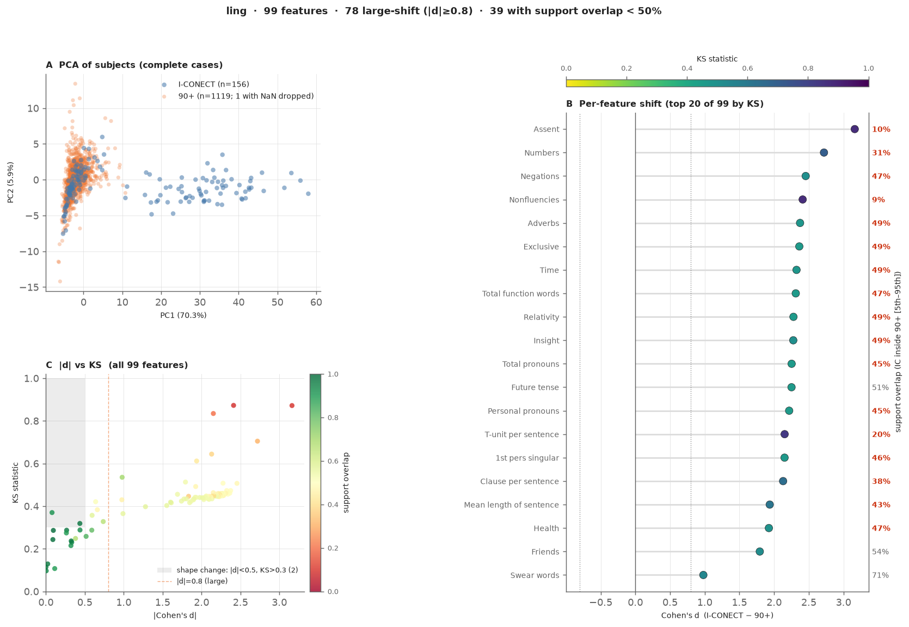

- **A｜PCA**：PC1 一个主成分就解释了 **70.3%** 的方差，载荷最大的是总词数、虚词总数、动词短语数、从句数等，也就是“说了多少话”。PC2 只有 5.9%，反映句子复杂度（每 T-单元长度等）。NP 和 85 名短对话受试者挤在左侧同一团（PC1 中位数分别为 −2.2 和 −2.6）；71 名长对话受试者沿 PC1 一路延伸到 58（中位数 31.6）。语言族的多变量差异几乎完全是**长对话组的“话量”差异**。
- **B｜逐特征偏移**：KS 最大的 20 个特征全部是 IC > NP 的计数型特征：同意类话语、数字词、否定词、言语不流利、副词、虚词、代词、句子数等，*d* 在 +1.0～+3.2 之间。右侧重叠率绝大多数集中在 **45%–49%**，正好对应“约一半 IC 受试者（长对话组）越界、另一半在范围内”。两个例外是 `Assent`同意类话语（10%）和 `Nonfluencies`言语不流利（9%）：这两项连短对话组也明显偏高（短组只有 16%–18% 落在 NP 范围内），更可能反映转写规范的差异（是否记录“嗯”“啊”等填充词）。
- **C｜\|*d*\| vs KS**：大部分点落在 |*d*| ≈ 1.5–2.5、KS ≈ 0.45 的**水平带**上（浅黄色，重叠率约 50%），即 2.3.2 样例 F 所说的“*d* 被子群拉高”。左下角的绿色点群（|*d*| < 0.5、重叠率高）是 15 个偏移很小的特征，**全部是比率或归一化指标**：每从句/每 T-单元的短语数、平均从句长度、各类 TTR 和 MTLD 等。阴影区（形状变异）只有 2 个特征。

**代表性特征：**

| 特征 | *d* | KS | std_ratio | 解读 |
|------|-----|----|-----------|------|
| `Assent`同意类话语 | +3.162 | 0.872 | 20.3 | 全族最大偏移，重叠率仅 10%；短对话组也偏高，可能是转写规范差异 |
| `Nonfluencies`言语不流利 | +2.412 | 0.873 | 61.7 | 方差是 NP 的 62 倍，重尾（见样例 D） |
| `Adverbs`副词 | +2.374 | 0.473 | 11.1 | 双峰：长组 147.8，短组 6.8，NP 6.7（见样例 F） |
| `Clause`从句数 | +2.243 | 0.450 | 9.30 | 句法计数随话量增长，与 LIWC 类别表现一致 |
| `Simple TTR`简单词型/词记比 | −0.976 | 0.430 | 1.90 | 全族唯一明显的负向偏移：文本越长 TTR 越低（长组 0.29，短组 0.67，NP 0.61），属于长度伪效应 |
| `Measure of lexical textual diversity [mtld_ma_bid]`MTLD（双向移动平均） | −0.004 | 0.097 | 0.85 | 与长度无关的多样性指标，两组几乎相同 |

**结论**：语言族的大幅偏移有很大一部分是**原始计数随对话时长增长**的结果，而不是语言风格本身的差异。换成比率/归一化指标后，偏移基本消失。因此对计数型特征做话语量归一化（除以总词数或发言时长）是使用前提；词汇多样性方面应选用 MTLD 等长度无关指标，避免 Simple TTR。

**可视化参考：** `results/plots/family/summary_ling.png`、`results/plots/ling/adverbs.png`、`assent.png`

### 5.3 声学族（acoustic）— 特征最多，偏移两极化

**420 个特征 | AUC = 1.000（仅 86 名 IC 受试者）| mean |*d*| = 1.102 | mean KS = 0.477 | 平均支持域重叠率 = 68.8% | mean |ΔR| = 0.220**

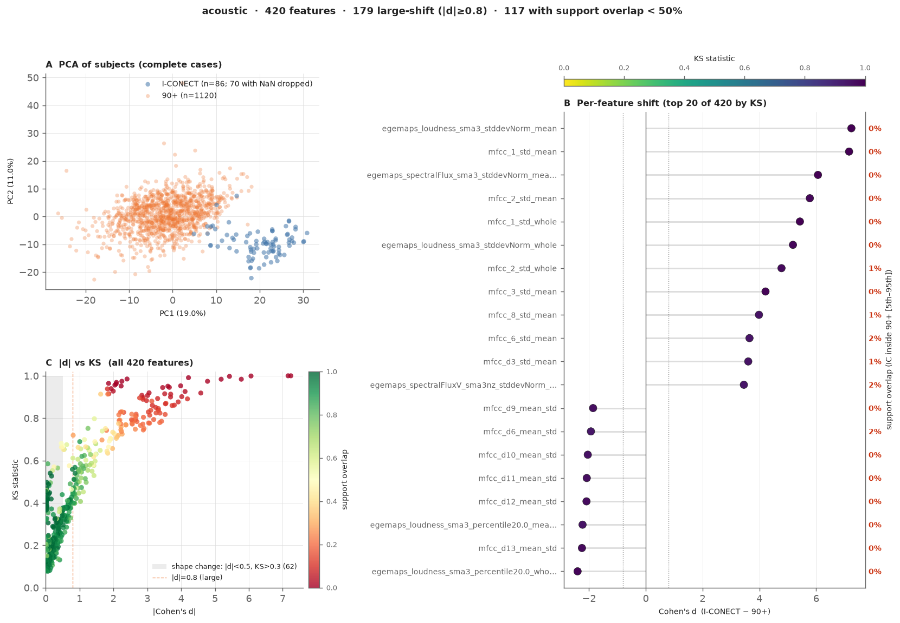

- **A｜PCA**：只有 86 名 IC 受试者有声学数据（70 人被剔除）。PC1（19.0%）主要由各 MFCC 系数及其差分的“标准差”类聚合构成，PC2（11.0%）主要是响度水平（中位数、均值）。69 名长对话受试者在右下方自成一簇（PC1 中位数 22.6），完全落在 NP 的 95% 区间（−15.9～11.1）之外；17 名短对话受试者（PC1 中位数 10.1）位于 NP 云团右缘。
- **B｜逐特征偏移**：KS 最大的 20 个特征 KS 都接近 1，重叠率几乎全是 0%–2%，即 IC 与 NP 完全分开。它们分成两组：
  - **正向**：响度、频谱通量、MFCC 1–8 的“标准差”类特征（*d* = +3.5～+7.2）：IC 录音的瞬时声学变化幅度远大于 NP。
  - **负向**：高阶 MFCC 差分的“均值的标准差”以及响度第 20 百分位（*d* ≈ −1.9～−2.4）。
- **C｜\|*d*\| vs KS**：420 个点呈现明显的**两极化**：
  - 右上方一大片红点（|*d*| > 2、KS > 0.8、重叠率接近 0），属于完全越界的特征。
  - 左下方一大片绿点（|*d*| < 0.5、重叠率高），可以放心迁移。
  - 中间过渡较少。

  阴影区内有 **62 个形状变异特征**（占全库形状变异特征的 94%），主要是 eGeMAPS 的 stddevNorm 类和 MFCC 差分类聚合，*d* 看不出它们的差异（见 4.3 节）。

**代表性特征：**

| 特征 | *d* | KS | std_ratio | 解读 |
|------|-----|----|-----------|------|
| `egemaps_loudness_sma3_stddevNorm_mean`响度归一化标准差的均值 | +7.241 | 1.000 | 1.59 | 全库第 1，重叠率 0% |
| `mfcc_1_std_mean`MFCC第1系数帧级标准差的均值 | +7.159 | 1.000 | 1.47 | MFCC std 系列的代表 |
| `egemaps_VoicedSegmentsPerSec_whole`每秒有声段数 | −3.328 | 0.845 | 1.21 | IC 语音中有声段密度更低 |
| `egemaps_loudness_sma3_percentile20.0_whole`响度第20百分位（整段） | −2.403 | 0.985 | 0.25 | IC 低端响度更低，且几乎无个体差异 |
| `egemaps_mfcc4_sma3_stddevNorm_whole`MFCC第4系数归一化标准差（整段） | −0.404 | 0.358 | 105.9 | 方差相差百倍，*d* 却很小 |

**结论与局限**：声学族的差异最可能来自录音条件（I-CONECT 为电话/视频录音，90plus 为现场录音）。但 IC 有声学数据的 86 人中，69 人来自长对话组，因此目前**无法把录音条件的影响与对话长度的影响分开**。对 stddevNorm 类特征应先做 z-score 或分位数变换；形状变异的 62 个特征建议做分位数变换，或直接剔除。

**可视化参考：** `results/plots/family/summary_acoustic.png`、`results/plots/acoustic/egemaps_loudness_sma3_stddevnorm.png`

### 5.4 语义族（semantic）— 迁移风险相对最低

**4 个特征 | AUC = 0.931 | mean |*d*| = 0.780 | mean KS = 0.422 | 平均支持域重叠率 = 73.4% | mean |ΔR| = 0.350**

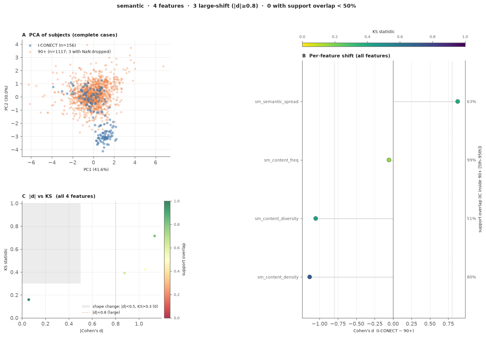

- **A｜PCA**：PC1（41.6%）是语义扩散度（载荷 +0.68）对内容词频率（−0.65）；PC2（30.0%）主要是内容多样性（载荷 +0.84）。85 名短对话受试者与 NP 完全混在一起；71 名长对话受试者在下方自成一簇（PC2 中位数 −3.0，NP 为 0.2），原因是长文本的内容多样性更低。
- **B｜逐特征偏移**：4 个特征的重叠率都不低于 50%，这是唯一没有任何特征越界的族。
  - `sm_content_density`内容词密度（*d* = −1.13）：KS 高达 0.715，重叠率却有 80%。两组范围重叠，但 IC 集中在较低一侧，属于方差压缩（std_ratio = 0.51）。长、短两组都低于 NP（0.40、0.38 vs 0.44）。
  - `sm_content_diversity`内容多样性（*d* = −1.05，重叠率 51%）：长组 0.50，短组 0.86，NP 0.81，是**长度伪效应**，与 Simple TTR 同理。
  - `sm_semantic_spread`语义扩散度（*d* = +0.88，重叠率 63%）：IC 话题范围略广。
  - `sm_content_freq`内容词频率（*d* = −0.06，重叠率 99%）：两组几乎相同（见样例 A）。
- **C｜\|*d*\| vs KS**：4 个点都在阴影区之外，没有形状变异；3 个点 |*d*| > 0.8，但颜色偏绿，重叠率较高。

**结论**：语义族是四族中最适合迁移的。内容多样性的偏移主要是长度伪效应，可通过长度归一化消除；内容词密度在两个子群中都偏低，是相对稳定的队列差异。

**可视化参考：** `results/plots/family/summary_semantic.png`、`results/plots/semantic/sm_content_freq.png`

---

## 六、域迁移风险综合评估

### 6.1 族级迁移风险排序

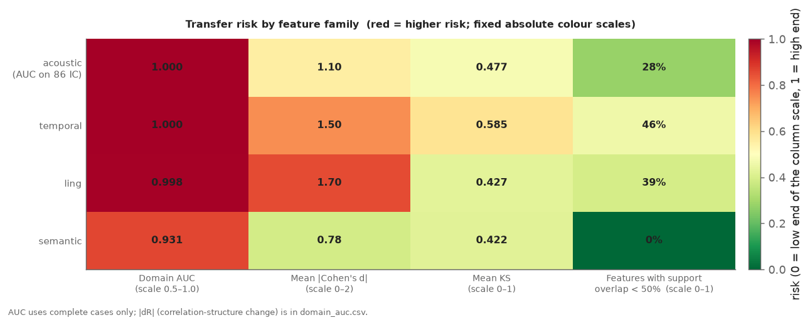

| 排名 | 特征族 | AUC | mean \|*d*\| | mean KS | 平均支持域重叠 | 重叠 < 50% 的特征 | n_feats | 风险等级 |
|------|--------|-----|---------|---------|----------|---------|---------|---------|
| 1 | temporal | 1.000 | 1.498 | 0.585 | 53.7% | 11（46%） | 24 | ⛔ 极高 |
| 2 | acoustic | 1.000 | 1.102 | 0.477 | 68.8% | 117（28%） | 420 | ⛔ 极高 |
| 3 | ling | 0.998 | 1.704 | 0.427 | 56.3% | 39（39%） | 99 | ⛔ 极高 |
| 4 | semantic | 0.931 | 0.780 | 0.422 | 73.4% | 0（0%） | 4 | 🔴 高 |

排序先看 AUC，AUC 相同时看平均支持域重叠率（越低风险越高）。没有任何特征族达到低迁移风险水平（AUC < 0.6）。

**如何读热力图：**
- **AUC 已经饱和**：三个族在 0.998–1.000，这一列几乎不能区分风险高低，只能说明四个族都可以被完美或近乎完美地分开。语义族的 0.931 仍属高风险，在固定色阶下是红色，而不是“相对最安全”的绿色。
- ***d* 与 KS 的排序不同**：按 mean |*d*| 是 ling > temporal > acoustic > semantic，按 mean KS 是 temporal > acoustic > ling > semantic。语言族的 |*d*| 最大，但 KS 并不高，这是因为它的大幅偏移集中在长对话子群（见 2.3.2 样例 F），*d* 被少数高值拉高。时序族在 KS 和“重叠率 < 50% 的特征占比”两列都最高，因此“时序族风险最高”的结论更稳健。
- **声学族单个特征偏移最极端，整体占比却最低**：它有 117 个特征几乎完全越界，但占全族的比例只有 28%，另有大量特征几乎没有偏移，所以族级平均 |*d*| 和 KS 都被稀释。族级风险不能代替对单个特征的筛选。
- **语义族没有任何特征越界**（0%），但 AUC 仍有 0.931：IC 与 NP 的范围重叠，分布集中的位置却不同。

AUC 只使用该族特征无缺失的受试者计算。声学族的 AUC 只基于 86 名 IC 受试者，其中 69 人来自长对话组；其余三族基本使用了全部 155–156 名 IC 受试者，所以声学族的 AUC 与其他族不可直接比较。

**可视化参考：** `results/plots/family/transfer_risk.png`

### 6.2 相关矩阵结构差异（ΔR）

对每个族，分别计算 IC 和 NP 内部的特征间 Pearson 相关矩阵，再取所有特征对 |RIC − RNP| 的均值。这一指标不进入 6.1 的风险热力图：四个族之间只相差 0.22–0.36，而且时序族里的高值主要来自长/短子群混合造成的伪相关，它反映的是“IC 内部有两类受试者”，并不是特征关系本身的稳定改变。

| 特征族 | mean \|ΔR\| | 含义 |
|--------|---------|------|
| ling | 0.361 | 特征间相关结构差异最大 |
| semantic | 0.350 | 4 个特征之间的关系明显改变 |
| temporal | 0.285 | 差异中等；部分高 ΔR 来自长/短子群混合造成的伪相关（如总轮次与受试者发言占比：IC r = 0.91，NP r = 0.11） |
| acoustic | 0.220 | 相关结构相对最稳定 |

即使校正了均值偏移，各族的相关矩阵仍有明显差异，仅靠 z-score 标准化无法完全消除域差异。其中一部分差异来自 IC 内部长/短子群的混合，按子群分层后可能会缩小。

---

## 七、结论与建议

### 7.1 主要结论

1. **两数据集之间存在系统性、多模态的大幅分布差异**，任何在 90plus 上训练的模型直接应用于 I-CONECT 数据都将面临严峻的域迁移挑战。

2. **分布差异的主要来源是数据收集协议，而非纯粹的人群差异**：
   - IC 内部有长/短对话两个子群。长对话组的对话更长（|*d*| = 3.73）、访谈员轮次更多（|*d*| = 3.48），导致语言族的计数型特征和语义多样性大幅偏移；短对话组在这些特征上与 NP 接近。
   - 停顿、轮次率、打断率等时序节奏特征在两个子群中都与 NP 明显不同，提示转写切分或说话人分离流程存在差异。
   - 声学特征的大幅差异可能反映电话/视频录音的信道特性，但由于 IC 声学数据几乎只来自长对话组，目前无法与对话长度的影响分开。

3. **偏移类型多样，需针对性处理**：
   - 均值平移型（160 个特征）：标准化/域适应可缓解
   - 方差倍增/压缩型（193 个特征）：需要方差对齐或特征选择
   - 形状畸变型（66 个特征）：单纯线性变换无效，需非线性校正或丢弃
   - 支持域不重叠型（如 `ix_interruption_rate`打断率）：该特征在跨数据集迁移中不可用

4. **比率/归一化指标是相对安全的选择**：语言族中 15 个偏移很小的特征全部是比率或归一化指标（每从句/每 T-单元的数量、MTLD 等）；语义族是四族中风险最低的（AUC = 0.931，没有特征越界）。Simple TTR、内容多样性这类对文本长度敏感的指标则应避免使用。

5. **相关矩阵结构差异（mean |ΔR| = 0.220–0.361）**表明特征间协方差关系在两数据集间不稳定，依赖特征间相关性的模型在跨数据集迁移时将产生额外误差。

### 7.2 迁移学习建议

| 建议 | 优先级 | 适用范围 |
|------|--------|---------|
| 对时序族的规模/计数特征进行话语量归一化（除以对话总时长或轮次数）；停顿/节奏特征先核查两数据集的转写切分流程 | 🔴 高 | 时序模态 |
| 对声学 stddevNorm 系列进行 z-score 标准化，或替换为排名/百分位特征 | 🔴 高 | 声学模态 |
| 删除 `ix_interruption_rate`打断率（IC 侧恒为 0、方差为 0，无法用于跨数据集迁移） | 🔴 高 | 时序模态 |
| 对语言族的计数型特征（LIWC 类别、句法计数等）进行话语量归一化（除以总词数或总发言时长） | 🔴 高 | 语言模态 |
| 对高 KS 低 \|*d*\| 的形状变异特征（66 个）考虑分位数变换（QuantileTransformer） | 🟡 中 | 声学模态 |
| 使用语言族中的比率/归一化指标（MTLD 等长度无关多样性指标、每从句/每 T-单元比率）和语义族特征作为迁移基础特征 | 🟡 中 | 初步迁移实验 |
| 在任何迁移前先进行域适应预处理（如 CORAL、MMD 最小化），处理协方差结构差异 | 🟡 中 | 系统级 |

### 7.3 下一步分析方向

- **方向一**：量化话语量归一化后各族 AUC 的变化，验证协议差异对偏移的贡献比例
- **方向二**：对形状变异型特征进行分位数变换后重新评估迁移风险
- **方向三**：把 IC 按长/短对话分组，分别与 NP 重做对比，区分对话长度造成的偏移和队列本身的差异（优先级最高）
- **方向四**：构建特征重要性权重，在下游认知衰退预测模型中降权高风险特征

---

## 附录：可视化索引

| 图像路径 | 内容描述 |
|---------|---------|
| `results/plots/family/summary_all_features.png` | 四象限全局摘要（PCA、Cohen's *d* 直方图、支持域重叠分布、\|*d*\| vs KS 散点图） |
| `results/plots/family/summary_<family>.png` | 四大族摘要图（PCA、逐特征偏移、\|*d*\| vs KS），共 4 张 |
| `results/plots/family/_overview_by_family.png` | 四大族的 \|*d*\| 分布条带图 |
| `results/plots/family/transfer_risk.png` | 四大族 × 四项风险指标（AUC、mean \|*d*\|、mean KS、重叠率 < 50% 的特征占比）热力图，固定绝对色阶 |
| `results/plots/ling/<feature>.png` | 各语言学特征的 IC vs NP 分布叠图 |
| `results/plots/temporal/<feature>.png` | 各时序特征的 IC vs NP 分布叠图 |
| `results/plots/semantic/<feature>.png` | 各语义特征的 IC vs NP 分布叠图 |
| `results/plots/acoustic/<feature>.png` | 各声学特征的 IC vs NP 分布叠图（egemaps + mfcc 共 420 张） |

完整交互式 dashboard（四大族摘要图浏览、Top 20 特征表，以及 547 个特征对应的 267 张分布图，支持按名称搜索，按 |*d*|、KS、偏移等级排序）：  
`docs/analysis/cross-cohort/2026-10-02-feature-distributions/dashboard.html`  
由 `build_dashboard.py` 根据 `run.py` 的输出生成；需与 `results/` 目录放在一起使用。

---

*本报告由自动化分析流水线生成，所有统计量直接来自 `results/all_features_stats.csv`（547 行）和 `results/domain_auc.csv`（10 行）。原始数据及代码见 `run.py`。*
